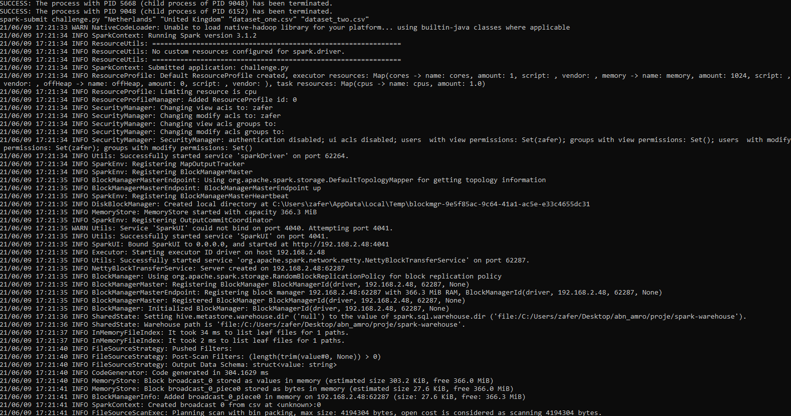
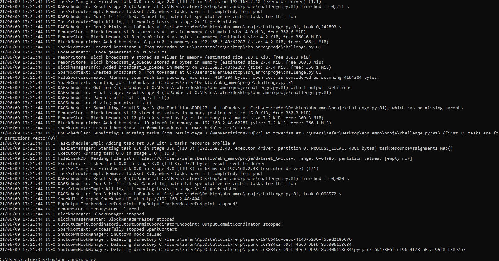
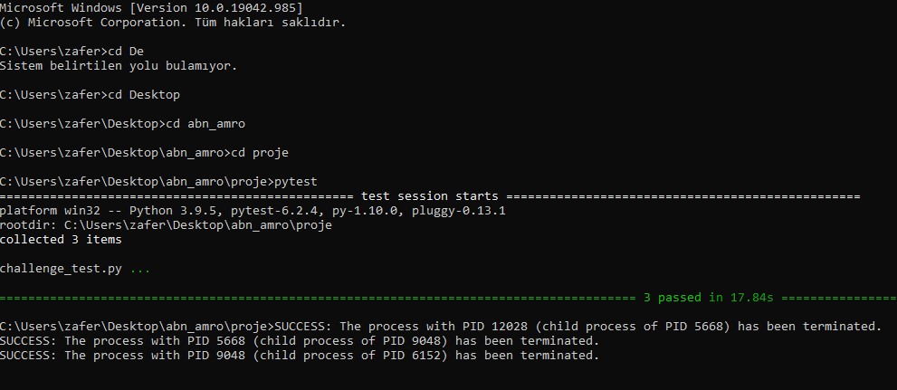

## Requirements For PySpark
```
Java Environment (JDK or JRE)
Python (3.7 or higher)
Spark-(3.1.2-bin-hadoop3.2O or other versions-http://spark.apache.org/downloads.html) 
For Windows you should initialize the System Variables and Paths of 
(SPARK_HOME,HADOOP_HOME and JAVA_HOME)
```
## Installing Requirements 
#### (_Requirement txt file exist_)

-All the Libraries except Pyspark has written to file named _requirements.txt_

-Just run the following command: _**"pip install -r requirements.txt"**_

## Which Libraries has been used


**pyspark**

**chispa**

**pandas** (_for only saving the csv, Because it should but following code didnt run on Windows_)

`
df.write.format('csv').option('header',True).mode('overwrite').option('sep',',').save('./client_data/mycsv.csv') )
`

**pytest**

**autopep8** (_For creating a better code view_)


## How app works?

1. Reading Csv's 

2. Filtering the country given as param(You can give any country,Just also change the name in the test for it)

3. Removing personal identifiable information from the first dataset,excluding emails

4. Remove credit card number from the second dataset

5. Data has joined using the id field

6. Renaming the columns for the easier readability to the business users as follows:

|Old name|New name         |
|--------|-----------------|
|id      |client_identifier|
|btc_a   |bitcoin_address  |
|cc_t    |credit_card_type |

7. Saving the output in _client_data_ directory in the root directory of the project.

8. There are three _**generic function**_ for works any type of data.
    
    * Read_csv
    * Filtering country choosen by user
    * Renaming colums 
    (you can chance and specify any column by changing names in the dictionary

## Submitting the Job
The application takes 3 arguments first paramether for the country chosen to filter other two are the csv file names

_**spark-submit challenge.py "Netherlands" "dataset_one.csv" "dataset_two.csv"**_




## Testing
-For all 3 create generic functions I used Testing which also includes chispa functions

-I have created another script for tests (**challenge_test.py**)

-If you just type _**"pytest"**_ from the project root it will run all test functions.



## Log and Log Rotating
-I have add following code to app for creating writing log into file.

-I used (log4j) for logging in Pyspark
```
log4jLogger = sc._jvm.org.apache.log4j
log4jLogger.LogManager.getLogger(__name__)
```
### Log Rotating
-I have initialise the script in \spark\conf\log4j.properties
-Added following code for Rotating and getting output "\proje\log\ 

```
# set the log level and name the root logger
# Available Levels: DEBUG, INFO, WARN, ERROR, FATAL
log4j.rootLogger=INFO, ROOT,console
# set the root logger class
log4j.appender.ROOT=org.apache.log4j.RollingFileAppender
# set the name/location of the log file to rotate
log4j.appender.ROOT.File=.\\log\\log.txt
# set the max file size before a new file (and backups) are made
log4j.appender.ROOT.MaxFileSize=10KB
# set how many iterations of the log file to keep before deleting old logs
log4j.appender.ROOT.MaxBackupIndex=5
# set log text formatting
log4j.appender.ROOT.layout=org.apache.log4j.PatternLayout
log4j.appender.ROOT.layout.ConversionPattern=%p %t %c - %m%n
```
-This two line for Rotating with file size

-It creates Max 5 file with 10KB size

-You can also create log rotating by using time by setting up above
```
log4j.appender.ROOT.MaxFileSize=10KB
# set how many iterations of the log file to keep before deleting old logs
log4j.appender.ROOT.MaxBackupIndex=5
```
## reStructuredText (reST) 
-All functions has docstring comments for informations.

## Travis Pipeline
-When you create a new push from master Node it automaticly run the script
named _".travis.yml"_


## Commits 
-I have push different tasks and scripst from different brances

## Setup.py

Setup.py file also added. You can use it as a source distrubition file.

## Important 

-I have finalized every task and including every bonus task
